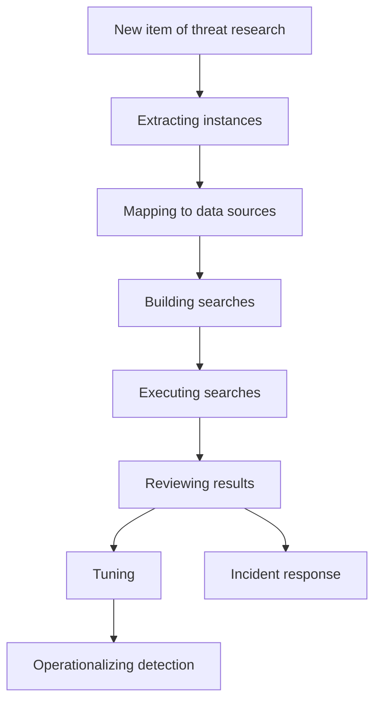
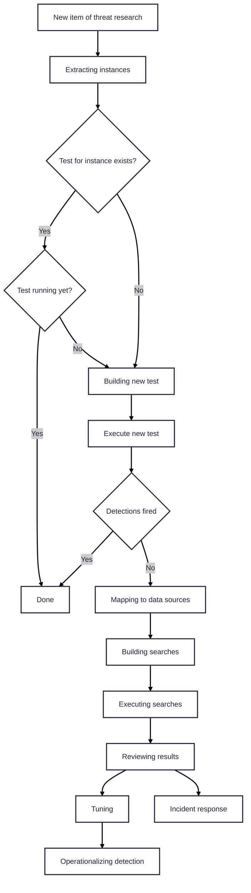

---
tags:
  - author/Jordan_Anderson
  - type/article
  - theme/validation
title: Turning the TIDE with Test-Initiated Detection Engineering
description: Test-Driven Development for detection engineering — how writing tests first transforms your library
aliases:
created: 2026-03-27
draft: false
promoted: true
---
Detection engineers are really good at writing rules. That's one of the core skills, enabling us to find the right combination of query logic that can [[identify impossible travel]] by [incorporating the Haversine formula into a 40-row Splunk query](https://community.splunk.com/t5/Reporting/Find-the-Distance-Between-Two-or-More-Geolocation-Coordinates/td-p/57653), or spitting out 6 rules in 4 hours after reading the threat intel report *du jour*. But most detection teams are drowning in operations work. Each rule in the library generates false positives that must be tuned, data sources regularly change (requiring migration or maintenance), and environmental shifts can unexpectedly break rules. The more rules we write, the worse the maintenance problem.

It's time to rethink our detection engineering process. We've been operating in [[content/index#Why thriving?|survival mode]] for far too long, doing our best to add all the rules as fast as we can. Adding rules is a necessary task to improve coverage, but there's a simple tweak we can apply to make detection writing far more sustainable: 

> Stop writing rules without writing validation tests first

## Benefits of TIDE

1. Similar to the Test-Driven Development (TDD) principle from which this concept is derived, starting with a validation test of the end state means our rules must match the "true positive" case before being released as valid
2. Using a test at the beginning minimizes detection scope creep, ensuring the rule intent remains focused on the original test design
3. Once written, validation tests can be scheduled, facilitating [[detection libraries must be repeatedly validated|ongoing detection validation]]
4. Validation tests can identify existing rules that already provide similar coverage
5. Custom tests are necessary for [[Validating vendor detection effectiveness]] — otherwise we take the vendor's assertions of coverage for granted
## Detection-writing process

Let me provide an example of how the detection-writing process could change by using TIDE.

This is a typical flow of intelligence-based detection creation:

In TIDE, that same flow looks like this:

## Instance- vs procedure-based tests

The flow diagram above is based on threat-intel-driven detection writing (which is the path most organizations are using to write detection content). If you need to write detections this way, adding a test will save a lot of time over the course of the detection's life or prevent you from adding a duplicate one. However, this model will eventually create the same kind of problems we have with detection libraries — endlessly rewriting the same tests based on new threat intel reports, or a large body of tests that need to be searchable, deduplicated, managed, and maintained. Depending on the type of detection, we should actually [[Acquire rules and tests for yielded techniques at scale]].

Another approach is to [[implement tests based on TRRs]]. Since [[Technique Research Report (TRR)|TRRs]] break techniques into isolated [[MITRE ATT&CK Procedures and Instances|procedures]], tests linked to these reports can [[prove coverage with validation tests|provide comprehensive, provable coverage]] for a given technique. This is a great goal, but we need many more TRRs before this is a sufficient option on its own.

[[Create tests at scale with GenAI|Creating tests at scale with GenAI]] may be possible in time, changing how we can approach instance- and procedure-based tests. More research is needed here.

## Other notes

- The Sigma rule repo has started [introducing unit tests for new rules](https://blog.sigmahq.io/sigmahq-quality-assurance-pipeline-d99eaba1760e) (to ensure they continue to match malicious logs even after being modified)
- I'm more partial to [[detection libraries must be repeatedly validated#Why use a system test|system than unit tests]], because I think you can identify more failure cases from a single test, but unit tests make it much easier to isolate potential problems
- [[detection libraries must be repeatedly validated#How to do repeated validation|Thoughts on how to execute validation tests]] (build vs buy)