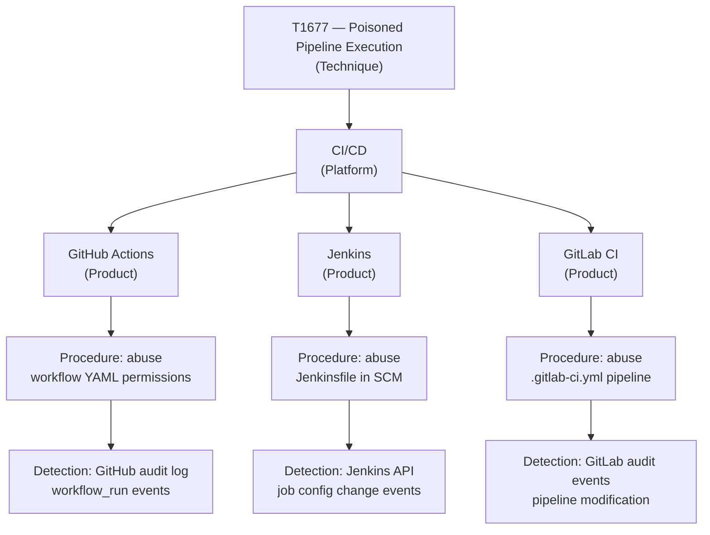

---
tags:
  - author/Jordan_Anderson
  - type/article
  - theme/coverage
title: MITRE ATT&CK is not flat
description: "Coverage claims are incomplete without accounting for ATT&CK's hidden dimension: technique × platform pairs."
aliases:
created: 2026-03-27
draft: false
promoted: false
---
The most common representation for MITRE ATT&CK® is as [a heatmap](https://attack.mitre.org/matrices/enterprise/) with two dimensions - width (tactics) and length (technique list), popularized by [ATT&CK Navigator](https://mitre-attack.github.io/attack-navigator/). However, this visualization hides depth in the form of platforms, which can be viewed in the sidebar [here](https://attack.mitre.org/matrices/enterprise/). Platforms are linked to a subset of techniques, and you're probably familiar with platforms like Windows, macOS, and Linux, but what about PRE, Containers, Office Suite, or ESXi? Here's what we never mention when discussing ATT&CK coverage:

> Organizations must detect attacks against each relevant `technique` x `platform` pair (TxP) to achieve "full coverage".

[Valid Accounts, Technique T1078 - Enterprise | MITRE ATT&CK®](https://attack.mitre.org/techniques/T1078/), for example, is in 10 different platforms, and coverage would not be complete without detection in all 10 platforms. I've written [[ACRE (ATT&CK Coverage Ratio Evaluation)|elsewhere]] about how difficult it is to measure coverage with a heatmap, and one key reason is it oversimplifies the landscape. How many technique-linked detections across how many platforms must be in place before you are willing to rate overall T1078 coverage as "good"?
## What platforms are in ATT&CK?

The current list of platforms can be found [here](https://attack.mitre.org/matrices/enterprise/), as well as an interactive navigator layer showing which techniques are linked to which platforms. 

The platforms break down into several categories as of this writing:

- [[MITRE ATT&CK® PRE]], 
- Windows
- MacOS
- Linux
- [Office Suite](https://attack.mitre.org/matrices/enterprise/cloud/officesuite/)
- [Identity Provider](https://attack.mitre.org/matrices/enterprise/cloud/identityprovider/)
- [SaaS](https://attack.mitre.org/matrices/enterprise/cloud/saas/)
- [IaaS](https://attack.mitre.org/matrices/enterprise/cloud/iaas/)
- [Network Devices](https://attack.mitre.org/matrices/enterprise/network-devices/)
- [Containers](https://attack.mitre.org/matrices/enterprise/containers/)
- [ESXi](https://attack.mitre.org/matrices/enterprise/esxi/)

### Can we use this platform list for coverage assessments?

One of the hardest problems when separating a set of items (techniques) into subsets (platforms) is ensuring they are [[Mutually Exclusive and Collectively Exhaustive (MECE)]]. MITRE made a valiant effort, but the current list of platforms does not meet this standard, which is a problem when we try to assess coverage against the technique x platform combinations.

There are several problems:

- It's not clear what the appropriate level of platform should be, but including `ESXi` but leaving out other specific hypervisor platforms (OpenStack, Hyper-V, etc) means this is not CE. It *is* ME currently (remaining distinct from `Containers`, which covers Kubernetes-style hypervisor workloads and the control plane), so any change would need to walk a fine line there.
- AWS provides `IaaS`-style `Container` hosting products, setting up a violation of the ME principle for that product.
- `SaaS` is a huge category of potential applications.
	- It's not ME because `Office Suite` is a specific sub-type of SaaS product
	- It's not CE because some techniques were included that are unique to a sub-SaaS-class. For example, [Poisoned Pipeline Execution, Technique T1677 - Enterprise | MITRE ATT&CK®](https://attack.mitre.org/techniques/T1677/) is included in `SaaS`, but it only applies to one type of SaaS product (CI/CD).
	- Using `SaaS` as the label unfortunately excludes similar products that are on-prem (not cloud-deployed). For example, Github Actions (as part of Github Enterprise) or Jenkins are types of CI/CD products which can be deployed on-prem and are subject to T1677-style attacks. 

I don't want to be too hard on MITRE — it is ==very difficult== to break attacker techniques into MECE-aligned categories while keeping the count of categories tight. But it does mean this list is not detailed enough to use as-is.
## Product vs Platform

Zooming out, there's a meta-problem - ==ATT&CK "platforms" are actually a mix of platform and product==, when both those levels need to be defined more clearly. *Techniques* may be common across a platform (T1677 applies to CI/CD products), but the *procedures* vary across each product (the implementation of the abused feature and the telemetry outputs are not exactly the same). 

Detection coverage requires linking detection rules to procedures, and procedures for the same technique can vary across different products. Consider T1677 mentioned earlier - the way this technique can be abused (and detected) varies across the CI/CD product implementing it, because the implementation of the abused feature and the telemetry outputs are done on a per-product basis (i.e. Github Actions vs Jenkins). Said another way, this technique needs procedure extraction (*a la* [[Technique Research Report (TRR)|TRRs]]) for each CI/CD product, and then to have per-product/per-procedure detection rules.

So, in order to identify the full coverage gap, we need *platforms* to link related *techniques* together and to build tests/rules related to *procedures* for each *product* inside those platforms. The diagram below gives a simplified example, with three different products and a procedure for each (though this is certainly not the complete list of procedures):

## Revisiting ATT&CK platforms

ATT&CK's existing platforms are a mix of product and platform. The **bolded** entries are the currently-defined ATT&CK platforms, and here an example of how they could fit into a platform/product model (note: the product lists are not meant to be collectively exhaustive (CE), it's an example):

- Endpoint/server OS
	- **Windows**
	- **MacOS**
	- **Linux**
	- Unix (?)
- Hypervisor
	- **ESXi** 
	- Openstack
	- Hyper-V
- **Office Suite**
	- Google Workspaces
	- Microsoft O365
- **IaaS**
	- AWS (excluding any managed container features)
	- GCP (etc)
	- Azure (etc)
- **Container**
	- Kubernetes
	- EKS (and other managed IaaS container products)
- **Network devices** OS
	- Juniper
	- Cisco
	- F5/Big-IP
- **Identity Provider**
	- Microsoft Entra
	- Okta
	- PingFederate
- CI/CD
	- Jenkins
	- Github Actions
	- Gitlab
- Other [[Trusted Service Infrastructure (TSI)]] categories
- Generic **SaaS** (we should prefer specific [[Trusted Service Infrastructure (TSI)|TSI-style]] application categories)

>  Organizations must detect attacks against each relevant `technique` x ==product== pair (TxPr) to achieve "full coverage".
## Conclusions

Expanding ATT&CK techniques into platform and product dimensions makes it obvious that measuring coverage is much more complex than it seems. Knowing that, what can we do to make incremental progress? 

- Recognize that ATT&CK-style coverage is inherently multi-dimensional, and that any metric treating it as flat will systematically undercount your gaps.
- Since *procedures* must be derived from each *technique* x *product* pairing, there will be a lot of [[Technique Research Report (TRR)|TRRs]] to write, especially for [[Trusted Service Infrastructure (TSI)]] products that are not well represented in ATT&CK yet.
- Stop using heatmaps to represent coverage: switch to [[ACRE (ATT&CK Coverage Ratio Evaluation)]] or another platform-aware metric.